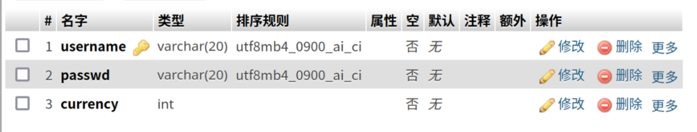
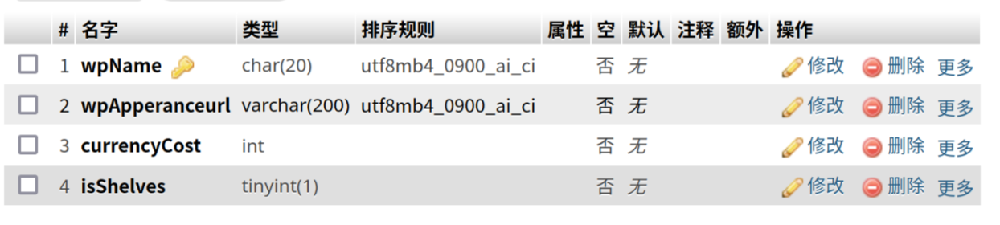

# 数据库实习
<hr>
## 运行图片（本地运行，不占用浏览器的端口）


## 这是数据库实习的产物
其中数据库由我的小组成员设计，前端和后端编写由我完成。由于之前没有前端和后端的基础，所以现在看来写的真是一言难尽。
如果大家想尝试运行这个简陋的项目，可以将```数据库SQL\gamemanage.sql```文件导入到mysql中，然后修改```js/connectToMysql.js```文件中的内容：
```
    host: '43.136.74.111',//数据库的地址，本地就填写localhost
    user: 'gamemanage',//数据库的用户
    password: '密码',//数据库的密码
    database: 'gamemanage', //数据库名称
```
接着进入到js文件夹下，运行如下命令：
```
node SQLOperation.js 
```
接着打开login.html就可以了，默认的登录用户有这些（前面是用户名，后面是密码，没有单引号哦，我随便写的用户名），由于没有考虑到安全性，密码是直接明文存储的，后续可能会改善：
```
'pee','zxc'
'splatoon','spl'
'test','1111'
'user','123'
'user1','1234'
'user2','12345'
'user6','6666'
```
<hr>
## 下面的是我的数据库的设计：


admin指的是管理员账户<br>
storehouse是仓库，用于存放用户仓库（是否有该武器中）<br>
user就是用户数据<br>
weapon就是武器的用于存放武器的各种参数<br>
### admin的结构如下：


adminNo属管理员编号<br>
adminPd就是管理员密码<br>
### storehouse的结构如下：


username就是用户的名称<br>
wpName就是指的武器的名称，本来准备把图片路径也放上的，但是这样会导致数据库的读性能下降，所以查询武器我就没有放上。<br>

### user的结构如下



username是用户名<br>
passwd是密码<br>
currency是货币，用于购买武器<br>
### weapon表的结构如下



wpName是武器名称<br>
wpApperanceurl是武器图片的路径<br>
currencyCost是需要消费的货币<br>
isShelves用于表示是否处于上架状态<br>